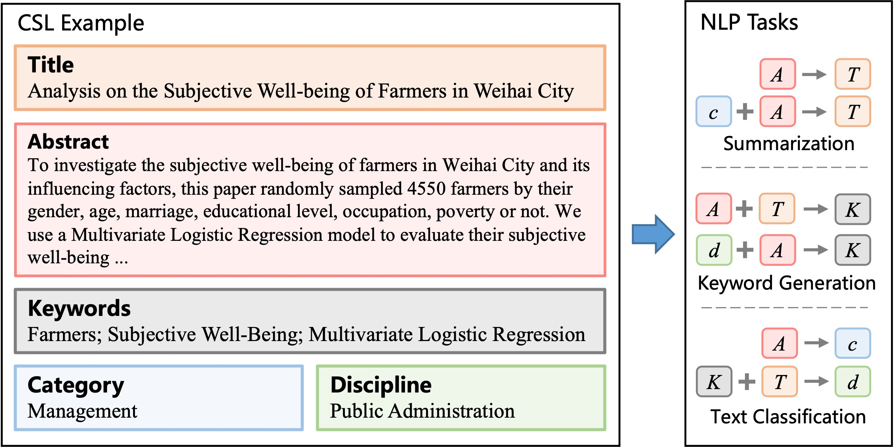

# Chinese Scientific Literature Dataset

**COLING 2022**

**CSL: A Large-scale Chinese Scientific Literature Dataset**  
*Yudong Li, Yuqing Zhang, Zhe Zhao, Linlin Shen, Weijie Liu, Weiquan Mao and Hui Zhang*

[English Documentation](./readme_en.md) | [Paper](https://arxiv.org/abs/2209.05034) | [Blog](https://mp.weixin.qq.com/s/uokFAO_5Exez5pogqQ0sow) | [BibTex](#bibtex)  

**tl; dr** 提供首个中文科学文献数据集（CSL），包含 396,209 篇中文核心期刊论文元信息
（标题、摘要、关键词、学科、门类）。CSL 数据集可以作为预训练语料，也可以构建许多NLP任务，例如文本摘要（标题预测）、
关键词生成和文本分类等。




## 数据集

CSL 数据获取自 [国家科技资源共享服务工程技术研究中心](https://nstr.escience.net.cn/)，
包含 2010-2020 年发表的期刊论文元信息（标题、摘要和关键词）。根据中文核心期刊目录进行筛选，
并标注学科和门类标签，分为 13 个门类（一级标签）和 67 个学科（二级标签）。
数据总量为 396,209 条，分布如下表所示：

|  Category       |          \#d | len(T) | len(A) | num(K) | \#Samples | Discipline Examples                                   |
|-----------------|-------------:|-------:|-------:|-------:|----------:|---------------------------------------|
|  Engineering    |           27 |   19.1 |  210.9 |    4.4 |   177,600 |  Mechanics,Architecture,Electrical Science   |
|  Science        |            9 |   20.7 |  254.4 |    4.3 |    35,766 |  Mathematics,Physics,Astronomy,Geography    |
|  Agriculture    |            7 |   17.1 |  177.1 |    7.1 |    39,560 |  Crop Science,Horticulture,Forestry          |
|  Medicine       |            5 |   20.7 |  269.5 |    4.7 |    36,783 |  Clinical Medicine,Dental Medicine,Pharmacy  |
|  Management     |            4 |   18.7 |  157.7 |    6.2 |    23,630 |  Business Management,Public Administration    |
|  Jurisprudence  |            4 |   18.9 |  174.4 |    6.1 |    21,554 |  Legal Science,Political Science,Sociology   |
|  Pedagogy       |            3 |   17.7 |  179.4 |    4.3 |    16,720 |  Pedagogy,Psychology,Physical Education      |
|  Economics      |            2 |   19.5 |  177.2 |    4.5 |    11,558 |  Theoretical Economics,Applied Economics      |
|  Literature     |            2 |   18.8 |  158.2 |    8.3 |    10,501 |  Chinese Literature,Journalism                |
|  Art            |            1 |   17.8 |  170.8 |    5.4 |     5,201 |  Art                                           |
|  History        |            1 |   17.6 |  181.0 |    6.0 |     6,270 |  History                                       |
|  Strategics     |            1 |   17.5 |  169.3 |    4.0 |     3,555 |  Military Science                              |
|  Philosophy     |            1 |   18.0 |  176.5 |    8.0 |     7,511 |  Philosophy                                    |
|  All            |           67 |        |        |        |   396,209 |                                                |

## 测评任务

为了推动中文科学文献 NLP 研究，本项目提供一系列测评基准任务。
测评任务数据集从 CSL 中抽样 10,000 条，按照 0.8 : 0.1 : 0.1的比例划分训练、验证和测试集。
为了提供公平的多任务学习设置，各任务使用相同的训练、验证和测试集。
任务数据集以 text2text 的形式提供，可以直接在基线模型（例如 T5）上进行多任务训练。


#### 1.文本摘要（标题预测）

输入论文的摘要，预测该论文的标题。

数据示例：
```
{ 
  "prompt": "to title",
  "text_a": "多个相邻场景同时进行干涉参数外定标的过程称为联合定标,联合定标能够 \
            保证相邻场景的高程衔接性,能够实现无控制点场景的干涉定标.该文提出了 \
            一种适用于机载InSAR系统的联合定标算法...",
  "text_b": "基于加权最优化模型的机载InSAR联合定标算法"
}
```

#### 2.关键词生成

输入论文的摘要和标题，预测该论文的关键词。

数据示例：
```
{ 
  "prompt": "to keywords",
  "text_a": "通过对72个圆心角为120°的双跨偏心支承弯箱梁桥模型的计算分析,以梁 \
            格系法为基础编制的3D-BSA软件系统为结构计算工具,用统计分析的方法建 \
            立双跨偏心支承弯箱梁桥结构反应在使用极限状态及承载能力极限状态下与 \
            桥梁跨长... 偏心支承对120°圆心角双跨弯箱梁桥的影响",
  "text_b": "曲线桥_箱形梁_偏心支承_设计_经验公式"
}
```

#### 3.论文门类分类

输入论文的标题，预测该论文所属的门类（13分类）。

数据示例：
```
{ 
  "prompt": "to category",
  "text_a": "基于模糊C均值聚类的流动单元划分方法——以克拉玛依油田五3中区克下组为例",
  "text_b": "工学"
},
{ 
  "prompt": "to category",
  "text_a": "正畸牵引联合牙槽外科矫治上颌尖牙埋伏阻生的临床观察",
  "text_b": "医学"
}
```

#### 4.论文学科分类

输入论文的摘要，预测该论文所属的学科（67分类）。

数据示例：
```
{ 
  "prompt": "to discipline",
  "text_a": "某铁矿选矿厂所产铁精矿含硫超过0.3%,而现场为了今后发展的需要,要 \
             求将含硫量降到0.1%以下.为此,针对该铁精矿中硫化物主要以磁黄铁矿 \
             形式存在、硫化物多与铁矿物连生且氧化程度较高的特点...",
  "text_b": "矿业工程"
},
{ 
  "prompt": "to discipline",
  "text_a": "为了校正广角镜头的桶形畸变,提出一种新的桶形畸变数字校正方法.它 \
             使用点阵样板校正的方法,根据畸变图和理想图中圆点的位置关系,得出 \
             畸变图像素在X轴和Y轴方向上的偏移量曲面...",
  "text_b": "计算机科学与技术"
}
```

## 代码与基线模型

实验在 UER-py 上测试了三个 text2text 基线模型（[T5](https://github.com/dbiir/UER-py/wiki/%E9%A2%84%E8%AE%AD%E7%BB%83%E6%A8%A1%E5%9E%8B%E4%BB%93%E5%BA%93#%E4%B8%AD%E6%96%87t5%E9%A2%84%E8%AE%AD%E7%BB%83%E6%A8%A1%E5%9E%8B)、
[BART](https://github.com/dbiir/UER-py/wiki/%E9%A2%84%E8%AE%AD%E7%BB%83%E6%A8%A1%E5%9E%8B%E4%BB%93%E5%BA%93#%E4%B8%AD%E6%96%87bart%E9%A2%84%E8%AE%AD%E7%BB%83%E6%A8%A1%E5%9E%8B) 
和 [Pegasus](https://github.com/dbiir/UER-py/wiki/%E9%A2%84%E8%AE%AD%E7%BB%83%E6%A8%A1%E5%9E%8B%E4%BB%93%E5%BA%93#%E4%B8%AD%E6%96%87pegasus%E9%A2%84%E8%AE%AD%E7%BB%83%E6%A8%A1%E5%9E%8B)）。

1. 克隆项目，下载预训练模型并放入 `UER-py/models/`

```
git clone https://github.com/ydli-ai/CSL.git
git clone https://github.com/dbiir/UER-py.git

cp CSL/run_text2text_csl.py UER-py/finetune/
```

2. 准备数据，单任务微调（以标题预测为例）
```
cp -r CSL/benchmark/ UER-py/datasets/

cd UER-py

python3 finetune/run_text2text_csl.py --pretrained_model_path models/t5_base.bin \
                                  --vocab_path models/google_zh_with_sentinel_vocab.txt \
                                  --output_model_path models/finetuned_model.bin \
                                  --config_path models/t5/base_config.json \
                                  --train_path datasets/benchmark/ts/train.tsv \
                                  --dev_path datasets/benchmark/ts/dev.tsv \
                                  --test_path datasets/benchmark/ts/test.tsv \
                                  --seq_length 512 --tgt_seq_length 48 --report_steps 200 \
                                  --learning_rate 3e-4 --batch_size 24 --epochs_num 5 --metrics 1
```


## 下载


|                  | Samples |                                                                            Access |
|------------------|--------:|----------------------------------------------------------------------------------:|
| CSL Benchmark    |     10k |                                                                        in project |
| CSL Sub-dataset  |     40k | [Google Drive](https://drive.google.com/file/d/1ve7ufyvf7ZtFygucgRrw-cKC2pqPlWZT) |
| CSL Full-dataset |    396k |                                                                  mail application |

CSL 数据集向科研用途公开，使用者许同意用途仅限**非商用目的**学术研究，并且同意不复制或分发 CSL 数据集。

获取完整数据集请以以下模版向 [Yudong Li](mailto:liyudong123@hotmail.com) 发送申请，发件邮箱**必须**是有效的大学（或科研机构）邮箱。

```
Subject: Application to download the CSL Full-dataset       
Name: <your first and last name>
Affiliation: <University where you work>
Department: <your department>
Position: <your job title>
Email: <must be the email at the above mentioned institution>

I have read and agree to the terms and conditions specified in the CSL dataset webpage.
This dataset will only be used for research purposes.
I will not make any part of this dataset available to a third party.
I'll not sell any part of this dataset or make any profit from its use.

我已阅读并同意 CSL 的使用协议: 本数据集只会被用于科研用途; 我不会将数据提供给第三方或者出售以获利。
```


## Shout-outs

CSL 已经被用于一些测评任务：

1. CLUE Benchmark 中文语言理解测评基准 - [CSL 关键词识别 Keyword Recognition](https://github.com/CLUEbenchmark/CLUE#csl-%E5%85%B3%E9%94%AE%E8%AF%8D%E8%AF%86%E5%88%AB--keyword-recognition-accuracy)

2. FewCLUE 小样本学习测评基准 - [CSLDCP 中文科学文献学科分类](https://github.com/CLUEbenchmark/FewCLUE#2-csldcp--%E4%B8%AD%E6%96%87%E7%A7%91%E5%AD%A6%E6%96%87%E7%8C%AE%E5%AD%A6%E7%A7%91%E5%88%86%E7%B1%BB%E6%95%B0%E6%8D%AE%E9%9B%86)

3. bert4keras - [论文标题生成](https://github.com/bojone/bert4keras/tree/master/examples#%E7%AE%80%E4%BB%8B)

## BibTeX

```
@inproceedings{li2022csl,
  title={CSL: A Large-scale Chinese Scientific Literature Dataset},
  author={Yudong Li and Yuqing Zhang and Zhe Zhao and Linlin Shen and Weijie Liu and Weiquan Mao and Hui Zhang},
  journal={arXiv preprint arXiv:2209.05034},
  year={2022}
}
```

